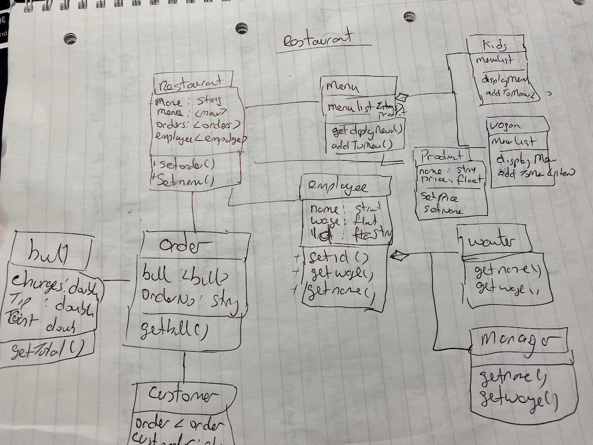

# OOP1 and OOP2 Assignment

Assignment is to demonstrate what was learned from the module to build a Java application.

##  OOP2 Requirements/ Features
Features that the application most show.

1. [O1_OOP2] Lambdas: for example: Consumer, Predicate, Supplier, Function etc..
2. [02_OOP2] Streams - terminal operations\
      min(), max(), count(), findAny(),\
      findFirst(), allMatch(), anyMatch(), noneMatch(), forEach() \
      collect() - Collectors.toMap(),\
       Collectors.groupingBy() and Collectors.partitioningBy()
3. [03_OOP2] Streams - intermediate operations e.g. filter(), distinct(), limit(), map() and sorted()
4. [04_OOP2] Switch expressions and pattern matching.
5. [05_OOP2] Sealed classes and interface.
6. [06_OOP2] Date/Time API.
7. [07_OOP2] Records.

** Advanced **

1. [A1_OOP2] Collections/generics - for example: use of Comparator.comparing() for sorting.
2. [A2_OOP2] Concurrency e.g. using ExecutorService to process a list of Callables.
3. [A3_OOP2] NIO2.
4. [A4_OOP2] Localisation.

##  OOP1 Requirements/ Features

Features that the application most show.
1. [01] Classes
    - contrast this() and this.
    - method overloading.
    - varargs.
    - LVTI.
2. [02] Encapsulation.
3. [03] Interfaces.
4. [04] Inheritance
   - overriding and polymorphism.
   - contrast super() and super.
5. [05] Exceptions (checked and unchecked)
6. [06] Enums.
7. [07] Arrays.
8. [08] Use of Java Core API (String, StringBuilder, List/ArrayList, Date API).

** Advanced **

1. [A1] Call-by-value and defensive copying.
2. [A2] Private, default and static interface methods.
3. [A3] Records. 
4. [A4] A custom immutable type.
5. [A5] Lambdas (Predicate).
   - discussion of ‘final’ or ‘effectively final’.
   - method references.
6. [A6] Switch expressions and pattern matching.
7. [A7] Sealed classes and interfaces.

## UML

Application domain will be based on restaurant application.

